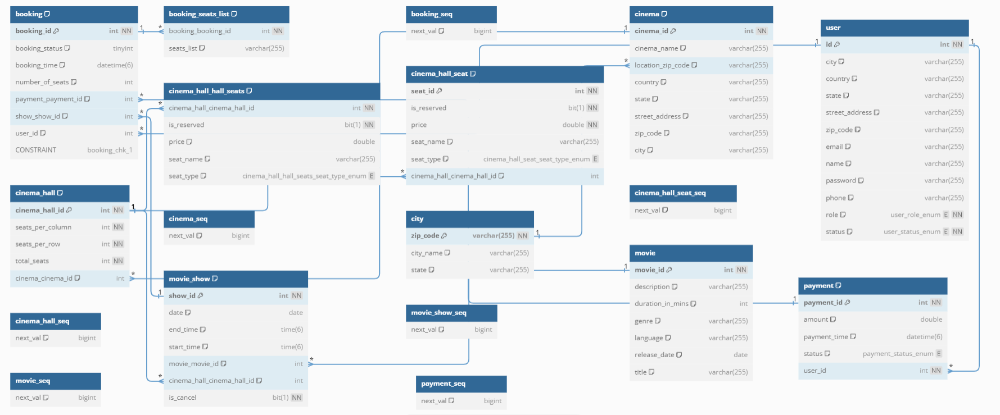

# Movie Ticket Booking System

This is a movie ticket booking system designed to manage affiliate cinemas, movie shows, and customer bookings. It allows customers to search for movies, book tickets, and pay using credit cards or cash. The system also sends notifications for new movies and booking updates.

## Features

1. **City Listing**: The system can list cities where affiliate cinemas are located.

2. **Cinema Halls and Shows**: Each cinema can have multiple halls, and each hall can run one movie show at a time. Movies can have multiple shows.

3. **Movie Search**: Customers can search for movies by title, language, genre, release date, and city name.

4. **Movie Details**: Customers can select a movie to view the cinemas running it and available showtimes.

5. **Ticket Booking**: Customers can select a show at a particular cinema and book their tickets. They can also choose their seats from a seating arrangement.

6. **Seat Availability**: The system distinguishes between available seats and booked ones.

7. **Notifications**: The system sends notifications for new movies, booking confirmations, and cancellations.

8. **Payment**: Customers can pay for their tickets using credit cards or cash. They can also apply discount coupons.

9. **Seat Reservation**: The system ensures that no two customers can reserve the same seat.

### ER-Diagram
 

### Use Case Diagram

We have four main Actors in our system:

* **Admin:** Responsible for adding new movies and their shows, canceling any movie or show, blocking/unblocking customers, etc.
* **FrontDeskOfficer:** Can book/cancel tickets.
* **Customer:** Can view movie schedules, book, and cancel tickets.
* **Guest:** All guests can search movies but to book seats they have to become a registered member.

Here are the top use cases of the Movie Ticket Booking System:

* **Search movies:** To search movies by title, genre, language, release date, and city name.
* **Create/Modify/View booking:** To book a movie show ticket, cancel it or view details about the show.
* **Make payment for booking:** To pay for the booking.
* **Assign Seat:** Customers will be shown a seat map to let them select seats for their booking.
* **Refund payment:** Upon cancellation, customers will be refunded the payment amount as long as the cancellation occurs within the allowed time frame.

## Contributing

If you would like to contribute to this project, please follow these guidelines:

- Fork the repository.
- Create a new branch for your feature or bug fix.
- Commit your changes with clear, concise messages.
- Push your changes to your fork.
- Open a pull request with a detailed description of your changes.

## License

This project is licensed under the MIT License - see the [LICENSE](LICENSE) file for details. 
